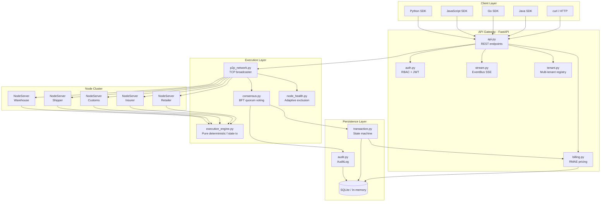
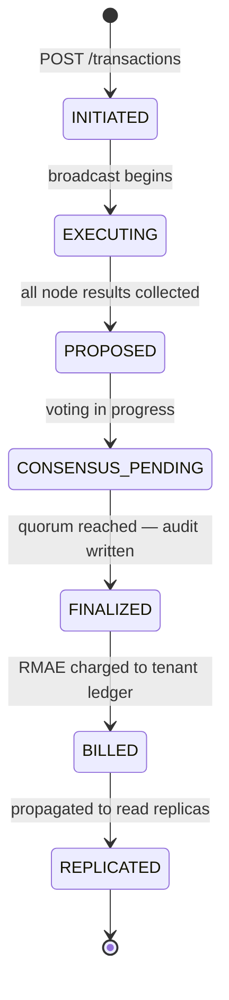
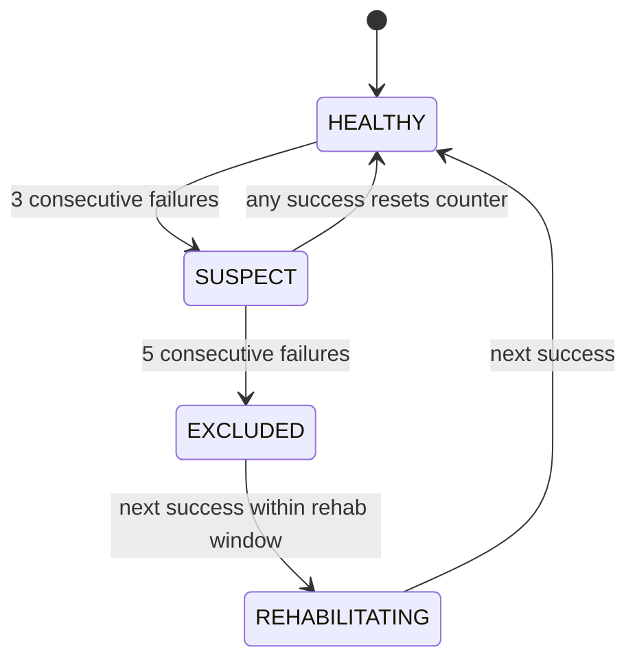

<div align="center">

# ECN
## Executable Consensus Network

**A production-grade Deterministic Multi-Party Execution System**

*Designed and built by Daniel Kimeu*

---


</div>

---

> ECN is the reference implementation of a new computing category: **Deterministic Multi-Party Execution Systems (DMES)**.
> Multiple independent nodes execute the same transaction, sign their outputs cryptographically, and reach Byzantine-fault-tolerant consensus on the result — not on ordering.
> No blockchain. No token. No central authority. Deployable in a single container.


---

## Table of Contents

- [The Category: What is DMES?](#the-category-what-is-dmes)
- [How ECN Works](#how-ecn-works)
- [Architecture](#architecture)
- [Transaction Lifecycle](#transaction-lifecycle)
- [Node Health and Byzantine Defense](#node-health-and-byzantine-defense)
- [Determinism Guarantees](#determinism-guarantees)
- [Supported Transaction Types](#supported-transaction-types)
- [Project Structure](#project-structure)
- [Quick Start](#quick-start)
- [Running the Demos](#running-the-demos)
- [REST API](#rest-api)
- [Event Streaming](#event-streaming)
- [Webhook Notifications](#webhook-notifications)
- [Enterprise Identity and RBAC](#enterprise-identity-and-rbac)
- [Multi-Tenant Isolation](#multi-tenant-isolation)
- [Python SDK](#python-sdk)
- [JavaScript SDK](#javascript-sdk)
- [Go SDK](#go-sdk)
- [Java SDK](#java-sdk)
- [Deployment](#deployment)
- [Running the Tests](#running-the-tests)
- [Credits](#credits)

---

## The Category: What is DMES?

Software has historically offered three ways to make a decision that multiple parties must trust:

1. **A central authority** — one server, one database, one company. Fast, but carries counterparty risk. If the authority lies or fails, you have no recourse.
2. **A public blockchain** — decentralized but slow, expensive, globally replicated, and indifferent to your data model.
3. **Manual reconciliation** — both parties run the numbers and compare later. Error-prone and dispute-generating by construction.

**ECN introduces a fourth option: the Deterministic Multi-Party Execution System (DMES).**

A DMES is a computational substrate where:

- The execution function is a pure, side-effect-free transformation: `f(state, transaction) → new_state`
- Every participating node executes the transaction independently, without seeing other nodes' results first
- Each node signs its output hash with a private key (Ed25519), making result manipulation cryptographically detectable
- A Byzantine-fault-tolerant quorum determines the agreed result — not a single trusted party
- Every round is permanently recorded in an append-only, cryptographically-attested audit trail

| Property | Traditional Blockchain | Central API | DMES (ECN) |
|---|---|---|---|
| Consensus target | Transaction ordering | Not applicable | Execution result |
| Fault detection | Invalid signature / fork | Not applicable | Hash mismatch + signature verification |
| Requires token | Yes | No | No |
| Single point of failure | No | Yes | No |
| Private / permissioned | No | Yes | Yes |
| State proof | Merkle Patricia trie | None | SHA-256 / Merkle root |
| Execution timing | After ordering | Immediate | Before consensus |
| Audit trail | On-chain | Optional | Immutable, cryptographic |
| Dispute resolution | On-chain | Manual | Automatic — fault proofs |

---

## How ECN Works

```
                         TRANSACTION SUBMITTED
                                  |
           +----------------------+----------------------+
           |                      |                      |
      [Warehouse]            [Shipper]              [Customs]
      Execute tx             Execute tx             Execute tx
      Sign result            Sign result            Sign result
           |                      |                      |
           +----------------------+----------------------+
                                  |
                         CONSENSUS MODULE
                     Verify all Ed25519 signatures
                     Count votes by output hash
                     Flag any divergent node
                                  |
                    +-------------+-------------+
                    |                           |
             CONSENSUS REACHED           FAULT DETECTED
             Agreed hash returned        Faulty node identified
             Audit event written         Fault proof recorded
             Billing entry appended      Alert dispatched
```

Every node executes independently. A node that produces a wrong answer cannot hide it — its signed output hash is permanently recorded and compared against the quorum result.

### The Consensus Round in Detail

1. A transaction is broadcast to all healthy nodes over real asyncio TCP connections.
2. Every node executes the transaction against its local state copy using the same deterministic engine. No shared memory. No shortcuts.
3. Each node signs its `(node_id, state_hash)` pair with its Ed25519 private key.
4. The consensus module verifies every signature before counting votes. A node with an invalid signature is flagged faulty before its hash is even examined.
5. Verified hashes are vote-counted. The plurality winner is the agreed result.
6. Any node whose hash diverges from the winner is permanently flagged.

```
Round 7 — product: LAPTOP-001  action: ship

  Warehouse  →  hash: 910b2fbb...  sig: 4696af...  HONEST
  Shipper    →  hash: 910b2fbb...  sig: 5d633c...  HONEST
  Customs    →  hash: 910b2fbb...  sig: 1bd112...  HONEST
  Insurer    →  hash: 910b2fbbDEAD  sig: ee2cd4...  FAULT — hash divergence
  Retailer   →  hash: 910b2fbb...  sig: a3f901...  HONEST

  Consensus  →  910b2fbb...   reached: TRUE
  Faulty     →  [Insurer]
  Billed     →  5 nodes x $0.005 = $0.025 RMAE
```

---

## Architecture

### System Overview



### Component Responsibilities

| Component | File | Responsibility |
|---|---|---|
| Deterministic Engine | `execution_engine.py` | Pure `f(state, tx) → new_state`. No I/O, no randomness, no floating point |
| Cryptographic Layer | `crypto.py` | Ed25519 key-pair generation, signing, verification |
| Node Server | `node_server.py` | asyncio TCP server wrapping a single node executor |
| P2P Broadcaster | `p2p_network.py` | Connects to all nodes, collects signed results, drives consensus |
| Consensus | `consensus.py` | Signature verification, plurality quorum, fault classification |
| Node Health | `node_health.py` | HEALTHY/SUSPECT/EXCLUDED/REHABILITATING lifecycle, p95 latency tracking |
| Transaction Lifecycle | `transaction.py` | Seven-state machine with enforced valid transitions |
| Audit Trail | `audit.py` | Append-only structured event log with fault records |
| Billing | `billing.py` | RMAE pricing, SLA tracking, append-only ledger |
| Stream | `stream.py` | Kafka-style ring-buffer EventBus, SSE live stream, offset polling |
| Auth | `auth.py` | API key registry, JWT validation, four-role RBAC |
| Tenant | `tenant.py` | Per-tenant isolated P2PNetwork on OS-assigned ports |
| REST API | `api.py` | FastAPI HTTP gateway — all external integrations |
| Python SDK | `sdk.py` | Typed client with helpers for every endpoint |

---

## Transaction Lifecycle

Every transaction in ECN passes through a seven-state machine with enforced valid transitions. No state can be skipped.



| State | Description |
|---|---|
| `INITIATED` | Transaction accepted, not yet dispatched |
| `EXECUTING` | Broadcast in flight — nodes are running the computation |
| `PROPOSED` | All results collected, awaiting quorum count |
| `CONSENSUS_PENDING` | Votes being tallied, signatures being verified |
| `FINALIZED` | Quorum reached. Audit event written. |
| `BILLED` | RMAE charged. Billing ledger entry appended (immutable). |
| `REPLICATED` | State propagated. Transaction complete. |

Query lifecycle status at any time:

```bash
GET /transactions/{tx_id}
```

```json
{
  "tx_id": "a1b2c3d4",
  "lifecycle_state": "FINALIZED",
  "billed_amount": 0.025,
  "duration_ms": 47
}
```

---

## Node Health and Byzantine Defense

ECN tracks the health of every node independently. Nodes that misbehave — by producing wrong answers, failing to respond, or responding suspiciously slowly — are automatically demoted before they can destabilize quorum.



### The Silent Killer Problem

A node that always responds just under the read timeout slows every round without ever being obviously wrong. ECN tracks a rolling p95 latency window (last 20 samples) per node and demotes high-latency nodes before they can act as a timing-based Byzantine actor.

### Quorum Configuration

| Environment Variable | Default | Description |
|---|---|---|
| `ECN_QUORUM_THRESHOLD` | `0.51` | Fraction of responding nodes that must agree |
| `ECN_QUORUM_MIN_RESPONSES` | `1` | Minimum responses before `InsufficientQuorumError` fires |

| Nodes | Threshold | Agreement needed | Faults tolerated |
|---|---|---|---|
| 5 | 0.51 | 3 / 5 | 2 |
| 5 | 0.67 | 4 / 5 | 1 |
| 7 | 0.67 | 5 / 7 | 2 |

Check node health via the API:

```bash
GET /network/nodes/{node_id}/health
```

---

## Determinism Guarantees

ECN's execution engine is a pure function. Given the same `(state, transaction)` pair, every node on every platform must produce exactly the same output hash or the divergence is a provable fault.

- **No randomness** — all operations are pure functions of `(state, tx)`
- **No floating point** — only integer arithmetic is used throughout
- **No system time** — nothing reads the clock during execution
- **Canonical JSON** — dictionary keys are always sorted before hashing
- **Deep copies** — input state is never mutated; the engine always works on a copy
- **Integer-only amounts** — all `amount` fields are cast to `int` at the boundary

---

## Supported Transaction Types

### Financial

| Type | Required fields | Description |
|---|---|---|
| `transfer` | `from`, `to`, `amount` | Move tokens between accounts |
| `mint` | `to`, `amount` | Create new tokens for an account |
| `burn` | `from`, `amount` | Destroy tokens from an account |

### Supply Chain

| Type | Required fields | Description |
|---|---|---|
| `ship` | `product_id`, `destination`, `shipper` | Dispatch a product |
| `receive` | `product_id`, `receiver`, `at_customs` | Accept delivery |
| `inspect` | `product_id`, `check_name`, `inspector` | Record a passed quality check |
| `quarantine` | `product_id`, `reason` | Flag product for investigation |
| `release` | `product_id`, `released_by` | Clear a quarantine hold |

Custom types can be added via `register_handler("my_type", handler_fn)`.

---

## Project Structure

```
ECN/
├── Dockerfile                    # Multi-stage container image
├── docker-compose.yml            # Single-command local deployment
├── requirements.txt              # Runtime dependencies
├── k8s/
│   ├── ecn.yaml                  # Kubernetes Namespace + Deployment + Service + HPA
│   └── ecn-multiregion.yaml      # Multi-region deployment manifest
└── ecn/
    ├── execution_engine.py       # Pure deterministic execution engine
    ├── state_manager.py          # State storage, SHA-256 / Merkle hashing, trace
    ├── node.py                   # Node: honest or malicious, Ed25519 signing
    ├── consensus.py              # Plurality-vote consensus + signature verification
    ├── network.py                # Simulated broadcast network (in-process)
    ├── crypto.py                 # Ed25519 key-gen, sign, verify; SignedResult
    ├── node_server.py            # Real asyncio TCP server per node
    ├── p2p_network.py            # Real TCP broadcast + consensus orchestration
    ├── node_health.py            # Per-node HEALTHY/SUSPECT/EXCLUDED lifecycle
    ├── transaction.py            # Seven-state transaction lifecycle machine
    ├── audit.py                  # Structured append-only audit trail
    ├── billing.py                # RMAE pricing, SLA tiers, immutable ledger
    ├── stream.py                 # Kafka-style EventBus, SSE, offset polling
    ├── auth.py                   # RBAC, API key registry, JWT validation
    ├── tenant.py                 # Multi-tenant isolated network registry
    ├── persistence.py            # SQLite stores (opt-in via ECN_DB_PATH)
    ├── api.py                    # FastAPI REST gateway
    ├── sdk.py                    # Python SDK client
    ├── dashboard.py              # Rich CLI live dashboard
    ├── trust_failure_demo.py     # Rich terminal attack-detection narrative
    ├── main.py                   # Demo: 3 simulated scenarios
    ├── demo_p2p.py               # Demo: 4 real-TCP + signed scenarios
    ├── use_cases/
    │   └── supply_chain.py       # Ship/receive/inspect/quarantine/release
    └── tests/                    # 478 tests across all modules
sdk/
├── js/
│   ├── ecn.js                    # JavaScript SDK (fetch, Node 18+ / browser)
│   ├── ecn.test.js               # 31 unit tests (node:test, mocked fetch)
│   └── package.json
├── go/
│   ├── ecnclient.go              # Go SDK (net/http, zero external dependencies)
│   ├── ecnclient_test.go         # 29 tests (net/http/httptest)
│   └── go.mod
└── java/
    └── ECNClient.java            # Java 11+ SDK (java.net.http, no dependencies)
```

---

## Quick Start

### Prerequisites

```bash
pip install fastapi "uvicorn[standard]" httpx requests cryptography rich pytest pytest-asyncio
```

### Start the API

```bash
uvicorn ecn.api:app --reload
# API docs: http://127.0.0.1:8000/docs
```

### Submit your first transaction

```bash
curl -X POST http://localhost:8000/transactions \
  -H "Content-Type: application/json" \
  -d '{"type":"ship","product_id":"LAPTOP-001","destination":"port","shipper":"DHL"}'
```

Response:

```json
{
  "tx_id": "a1b2c3d4-...",
  "round_id": 1,
  "timestamp": "2026-04-03T21:34:48Z",
  "lifecycle_state": "REPLICATED",
  "consensus_reached": true,
  "agreed_hash": "910b2fbb...",
  "billed_amount": 0.025,
  "duration_ms": 44,
  "honest_nodes": ["Warehouse", "Shipper", "Customs", "Insurer", "Retailer"],
  "faulty_nodes": [],
  "votes": [
    { "node_id": "Warehouse", "state_hash": "910b2fbb...", "signature": "4696af...", "status": "honest" },
    { "node_id": "Shipper",   "state_hash": "910b2fbb...", "signature": "5d633c...", "status": "honest" }
  ]
}
```

---

## Running the Demos

### Simulated network — no real TCP

```bash
python -m ecn.main
```

### Real TCP + Ed25519 signatures + supply chain

```bash
python -m ecn.demo_p2p
```

### Trust Failure Demo

```bash
python -m ecn.trust_failure_demo
```

A pharmaceutical supply chain where a compromised auditor node attempts to inject a false state. ECN detects the attack instantly, isolates the attacker node, and prints a full cryptographically-verifiable audit trail to the terminal using a `rich`-powered narrative interface.

### Live CLI Dashboard

```bash
python -m ecn.dashboard
```

A `rich`-powered live terminal dashboard showing:
- Network topology table (node IDs, ports, key prefixes, health state)
- Real-time transaction feed (round history with consensus outcomes)
- Consensus health meter (fault rate, round counter, quorum status)
- Fault alert panel (recent attacks and anomalies)

---

## REST API

Start the server:

```bash
uvicorn ecn.api:app --reload
# Interactive docs: http://127.0.0.1:8000/docs
```

### Endpoint Reference

| Method | Path | Description |
|---|---|---|
| `POST` | `/transactions` | Submit a transaction; returns full consensus result |
| `GET` | `/transactions/{tx_id}` | Query transaction lifecycle state |
| `GET` | `/network/nodes` | List all nodes (ID, port, public key, health) |
| `GET` | `/network/nodes/{node_id}/health` | Per-node health record |
| `GET` | `/network/state` | Network-wide health summary |
| `GET` | `/audit/events` | Full paginated audit trail |
| `GET` | `/audit/events/faults` | Only rounds with detected faults |
| `GET` | `/audit/events/{round_id}` | Single round by number |
| `GET` | `/audit/summary` | Aggregate statistics and top faulty nodes |
| `GET` | `/audit/replay` | Full transaction replay log (debug only) |
| `POST` | `/webhooks` | Subscribe a URL to round notifications |
| `GET` | `/webhooks` | List active webhook subscriptions |
| `DELETE` | `/webhooks/{webhook_id}` | Remove a subscription |
| `GET` | `/stream/topics` | List topics and current offsets |
| `GET` | `/stream/topics/{topic}` | Offset-based event polling |
| `GET` | `/stream/events` | SSE live event stream |
| `POST` | `/admin/api-keys` | Issue a new API key (admin only) |
| `DELETE` | `/admin/api-keys/{key_id}` | Revoke an API key (admin only) |
| `GET` | `/admin/api-keys` | List all keys (admin only) |
| `POST` | `/tenants` | Create a new isolated tenant |
| `GET` | `/tenants` | List all tenants |
| `DELETE` | `/tenants/{tenant_id}` | Destroy a tenant and its nodes |
| `GET` | `/tenants/{id}/billing-ledger` | Immutable billing entries for tenant |
| `GET` | `/tenants/{id}/sla` | SLA tier, compliance status, fault rate |

---

## Event Streaming

ECN provides Kafka-style topic-based event delivery with no external broker required.

### Topics

| Topic | Published when |
|---|---|
| `transactions` | After every consensus round |
| `faults` | Only when one or more faulty nodes are detected |

### Offset-based polling

```bash
# List topics and current offsets
curl http://localhost:8000/stream/topics

# Poll 10 events from offset 0
curl "http://localhost:8000/stream/topics/transactions?offset=0&limit=10"
# Use next_offset from the response in your next request
```

### Server-Sent Events live stream

```bash
# Live stream of all transactions
curl -N http://localhost:8000/stream/events

# Fault alerts only
curl -N "http://localhost:8000/stream/events?topics=faults"

# Backfill the last 50 events, then continue live
curl -N "http://localhost:8000/stream/events?backfill=50"
```

Each SSE data line is JSON: `{"seq": 3, "payload": { <AuditEvent> }}`. A heartbeat comment is sent every 15 seconds when idle.

---

## Webhook Notifications

Subscribe any HTTPS endpoint to receive real-time POST notifications after every round.

```bash
# Subscribe to all events
curl -X POST http://localhost:8000/webhooks \
  -H "Content-Type: application/json" \
  -d '{"url": "https://my-system.com/ecn-hook", "events": []}'

# Subscribe to fault alerts only
curl -X POST http://localhost:8000/webhooks \
  -H "Content-Type: application/json" \
  -d '{"url": "https://my-siem.com/alerts", "events": ["fault"]}'

# List active subscriptions
curl http://localhost:8000/webhooks

# Unsubscribe
curl -X DELETE http://localhost:8000/webhooks/<webhook_id>
```

---

## Enterprise Identity and RBAC

Role-based access control is opt-in. To enable it:

```bash
export ECN_AUTH_ENABLED=1
export ECN_ADMIN_KEY=your-bootstrap-admin-key
uvicorn ecn.api:app
```

ECN accepts both API keys (`X-API-Key` header) and JWT bearer tokens (`Authorization: Bearer <token>`). JWT configuration: `ECN_JWT_SECRET` (required), `ECN_JWT_ISSUER`, `ECN_JWT_AUDIENCE` (optional).

### Roles

| Role | Permitted operations |
|---|---|
| `admin` | All operations + manage API keys |
| `submitter` | `POST /transactions` + all `GET` endpoints |
| `auditor` | `GET /audit/*` + `GET /network/*` + `GET /stream/*` |
| `readonly` | `GET /network/state` + `GET /audit/summary` only |

### Issue a key

```bash
curl -X POST http://localhost:8000/admin/api-keys \
  -H "X-API-Key: your-bootstrap-admin-key" \
  -H "Content-Type: application/json" \
  -d '{"role": "submitter", "description": "ci-pipeline"}'
```

---

## Multi-Tenant Isolation

Each tenant is a completely isolated execution environment: independent nodes, independent audit log, independent billing ledger, independent webhooks.

```mermaid
graph LR
    subgraph Tenant A - Bank
        N_A1[Node 1] & N_A2[Node 2] & N_A3[Node 3]
        AUDIT_A[Audit Log A]
        BILL_A[Billing Ledger A]
    end
    subgraph Tenant B - Insurer
        N_B1[Node 1] & N_B2[Node 2] & N_B3[Node 3] & N_B4[Node 4] & N_B5[Node 5]
        AUDIT_B[Audit Log B]
        BILL_B[Billing Ledger B]
    end
    API[ECN API] --> Tenant A - Bank
    API --> Tenant B - Insurer
```

```bash
# Create a tenant (spawns its own node network on OS-assigned ports)
curl -X POST http://localhost:8000/tenants \
  -H "Content-Type: application/json" \
  -d '{"name": "Bank-A", "node_count": 3}'

# Submit within the tenant namespace
curl -X POST http://localhost:8000/tenants/<tenant_id>/transactions \
  -H "Content-Type: application/json" \
  -d '{"type": "ship", "product_id": "ITEM-001", "destination": "vault", "shipper": "BankCo"}'

# Immutable billing ledger for this tenant
curl http://localhost:8000/tenants/<tenant_id>/billing-ledger

# SLA compliance status
curl http://localhost:8000/tenants/<tenant_id>/sla
```

### RMAE Pricing Tiers

The billing unit is the **Resolved Multi-Party Agreement Event (RMAE)**: `node_count x price_per_rmae`.

| Tier | SLA Commitment | Quorum Threshold | Price per RMAE |
|---|---|---|---|
| `basic` | 95% uptime | 0.51 | $0.001 |
| `standard` | 99% uptime | 0.67 | $0.005 |
| `critical` | 99.99% uptime | 0.80 | $0.020 |

Set via `ECN_PRICING_TIER=basic|standard|critical` (default: `standard`).

---

## Python SDK

```python
from ecn.sdk import ECNClient

with ECNClient("http://localhost:8000") as client:
    # Supply-chain transactions
    result = client.ship("LAPTOP-001", destination="port", shipper="DHL")
    result = client.inspect("LAPTOP-001", check_name="label_check", inspector="QA")
    result = client.receive("LAPTOP-001", receiver="customs", at_customs=True)
    result = client.quarantine("LAPTOP-001", reason="suspicious_origin")
    result = client.release("LAPTOP-001", released_by="RegulatorA")

    print(result["consensus_reached"])   # True
    print(result["faulty_nodes"])        # [] (or list of detected malicious nodes)

    # Network health
    state = client.network_state()
    print(f"Fault rate: {state['fault_rate'] * 100:.1f}%")

    # Audit trail
    summary = client.audit_summary()
    print(summary["top_faulty_nodes"])

    # Webhook event streaming
    sub = client.subscribe_webhook("https://my-siem.example.com/ecn", events=["fault"])
    client.unsubscribe_webhook(sub["webhook_id"])
```

#### Error handling

```python
from ecn.sdk import ECNClient, ECNTransactionError, ECNNotFoundError

with ECNClient("http://localhost:8000") as client:
    try:
        client.ship("UNKNOWN-PRODUCT", destination="port", shipper="DHL")
    except ECNTransactionError as e:
        print(f"Transaction rejected: {e.detail}")
    try:
        client.audit_event(9999)
    except ECNNotFoundError:
        print("Round not found")
```

---

## JavaScript SDK

No dependencies. Uses built-in `fetch` (Node.js 18+ or any modern browser).

```js
import { ECNClient } from './sdk/js/ecn.js';

const client = new ECNClient('http://localhost:8000');

// Supply-chain transaction
const result = await client.ship('LAPTOP-001', { destination: 'port', shipper: 'DHL' });
console.log(result.consensus_reached); // true

// Kafka-style event polling
let offset = 0;
while (true) {
  const batch = await client.pollEvents('transactions', { offset, limit: 20 });
  console.log(batch.events);
  offset = batch.next_offset;
  if (batch.count < 20) await new Promise(r => setTimeout(r, 1000));
}

// Multi-tenant
const tenant = await client.createTenant('Bank-A', { nodeCount: 3 });
await client.tenantShip(tenant.tenant_id, 'ITEM-001', { destination: 'vault', shipper: 'BankCo' });
```

Run tests: `cd sdk/js && node --test ecn.test.js` (31 tests)

---

## Go SDK

Zero external dependencies. Uses standard `net/http`.

```go
import ecnclient "github.com/ecn/sdk"

client := ecnclient.New("http://localhost:8000", nil)

// Ship a product
result, err := client.Ship("LAPTOP-001", "port", "DHL")
fmt.Println(result.ConsensusReached) // true

// Kafka-style event polling
offset := 0
for {
    batch, _ := client.PollEvents("transactions", offset, 20)
    offset = batch.NextOffset
    if batch.Count < 20 { time.Sleep(time.Second) }
}

// Multi-tenant
tenant, _ := client.CreateTenant("Bank-A", 3, nil)
result, _  = client.TenantShip(tenant.TenantID, "ITEM-001", "vault", "BankCo")

// Authenticated deployment
adminClient := ecnclient.New("http://ecn.internal", &ecnclient.Options{
    APIKey: os.Getenv("ECN_API_KEY"),
})
```

Run tests: `cd sdk/go && go test ./...` (29 tests)

---

## Java SDK

Requires Java 11+. Zero dependencies — uses `java.net.http.HttpClient`.

```java
import ecnclient.ECNClient;

// Default: 30s timeout, no auth
ECNClient client = new ECNClient("http://localhost:8000");

// Or with auth and custom timeout
ECNClient client = ECNClient.builder("http://localhost:8000")
    .apiKey(System.getenv("ECN_API_KEY"))
    .timeout(Duration.ofSeconds(10))
    .build();

// Supply-chain (returns raw JSON strings)
String result = client.ship("LAPTOP-001", "port", "DHL");
String summary = client.auditSummary();

// Kafka-style polling
int offset = 0;
while (true) {
    String events = client.pollEvents("transactions", offset, 20);
    // parse JSON, advance offset from next_offset field
    Thread.sleep(1_000);
}

// Multi-tenant
String tenant = client.createTenant("Bank-A", 3, List.of());
String txResult = client.tenantShip(tenantId, "ITEM-001", "vault", "BankCo");
```

---

## Deployment

### Docker — single container

```bash
# Build
docker build -t ecn:latest .

# Run (all 5 supply-chain nodes start in-process)
docker run -p 8000:8000 ecn:latest

# API docs: http://localhost:8000/docs
```

### Docker Compose — multi-container demo

```bash
# Start the ECN API in the background
docker compose up -d

# Run the trust-failure attack demo against the live container
docker compose --profile demo up ecn-trust-demo

# Tail API logs
docker compose logs -f ecn-api

# Stop everything
docker compose down
```

### Kubernetes

```bash
# Deploy to the current cluster context
kubectl apply -f k8s/ecn.yaml

# Watch rollout
kubectl -n ecn rollout status deployment/ecn-api

# Port-forward to access the API locally
kubectl -n ecn port-forward svc/ecn-api 8000:80

# Scale manually
kubectl -n ecn scale deployment ecn-api --replicas=4

# Tear down
kubectl delete namespace ecn
```

The `HorizontalPodAutoscaler` automatically scales from 2 to 10 replicas based on CPU usage. A `ConfigMap` controls node IDs, quorum threshold, pricing tier, and product catalogue without rebuilding the image.

### Environment Variables

| Variable | Default | Description |
|---|---|---|
| `ECN_AUTH_ENABLED` | unset | Set to `1` to enable RBAC |
| `ECN_ADMIN_KEY` | unset | Bootstrap admin API key |
| `ECN_JWT_SECRET` | unset | HMAC secret for JWT validation |
| `ECN_JWT_ISSUER` | unset | Expected JWT issuer claim |
| `ECN_JWT_AUDIENCE` | unset | Expected JWT audience claim |
| `ECN_DB_PATH` | unset | Path to SQLite file; omit for in-memory |
| `ECN_QUORUM_THRESHOLD` | `0.51` | Minimum agreement fraction for consensus |
| `ECN_QUORUM_MIN_RESPONSES` | `1` | Minimum node responses before error |
| `ECN_NODE_HOST` | `127.0.0.1` | Bind address for node TCP servers |
| `ECN_PRICING_TIER` | `standard` | `basic`, `standard`, or `critical` |
| `ECN_DEBUG` | unset | Set to `1` to enable replay endpoint |
| `ECN_PRODUCTS` | (defaults) | Comma-separated product IDs |
| `ECN_NODES` | (defaults) | Comma-separated node IDs |

---

## Running the Tests

```bash
pip install pytest pytest-asyncio fastapi "uvicorn[standard]" httpx requests
python -m pytest ecn/tests/ -q
```

**478 tests pass** across all modules:

| Suite | Tests | Coverage |
|---|---|---|
| execution engine | 18 | Determinism, integer enforcement, error paths |
| consensus | 24 | Signature verification, plurality voting, quorum thresholds |
| crypto | 14 | Key generation, signing, verification, tamper detection |
| node | 16 | Honest / malicious execution, state transitions |
| network | 20 | Simulated broadcast, fault injection |
| p2p network | 22 | Real TCP, quorum failure, node exclusion |
| audit | 18 | Event recording, fault filtering, summary stats |
| stream | 20 | Ring buffer, offset polling, SSE delivery |
| auth | 28 | RBAC enforcement, API key lifecycle, JWT validation |
| billing | 24 | RMAE pricing, SLA tier transitions, ledger immutability |
| transaction | 18 | State machine transitions, invalid transition rejection |
| node health | 20 | HEALTHY/SUSPECT/EXCLUDED/REHABILITATING lifecycle |
| persistence | 22 | SQLite stores, schema migrations, in-memory fallback |
| API | 48 | All REST endpoints, error handling, pagination |
| SDK | 22 | Python client helpers, error types |
| supply chain | 18 | Ship/receive/inspect/quarantine/release domain logic |
| tenant API | 32 | Tenant isolation, lifecycle, billing per tenant |
| lifecycle API | 14 | Transaction status polling, lifecycle transitions |
| billing ledger | 16 | Append-only guarantees, per-tenant scoping |
| JWT auth | 12 | JWT decode, issuer/audience validation, role extraction |
| **Total** | **478** | |

JavaScript SDK: `cd sdk/js && node --test ecn.test.js` (31 tests)

Go SDK: `cd sdk/go && go test ./...` (29 tests)

---

## Credits

ECN — Executable Consensus Network

Designed, architected, and built by **Daniel Kimeu**.

All concepts, primitives, and implementations in this repository — including the
Deterministic Multi-Party Execution System category definition, the RMAE billing
model, the seven-state transaction lifecycle, the adaptive Byzantine node health
system, the multi-tenant isolation architecture, and the four-language SDK
suite — originate from Daniel Kimeu's work.

---

*Reference implementation of the DMES computing model.*
*All rights reserved. Daniel Kimeu, 2026.*
